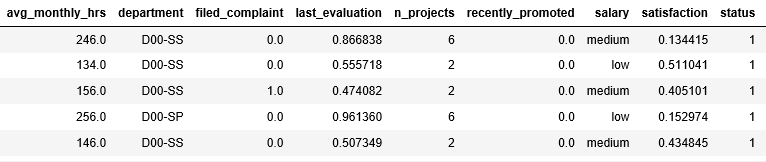
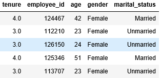

# EmployeesDataset
EDA of Employees Data and apply Decision Tree and Random Forest to predict the probability and status whether employee will continue with organization.

## INTRODUCTION
The dataset consist of the information about the employees of 11 departments. Various variables are present in the dataset includes employee Id, department, avg monthly hours, filed_complaint, last_evaluation, salary, recently promoted, satisfaction, status, tenure, n_projects, age, gender, marital status.

It comprises of 2,40,000 observation.

## DATA
| Column Name | Description |
| --- | --- |
| `Employee Id` | Employee Unique ID |
| `Department` | In which department employee work |
| `Avg Monthly Hours` | No of hours he worked in a month |
| `Filed Complaint` | Is Employee filed any complain |
| `Last Evaluation`| Last evaluation score It varies from 0-1 |
| `Salary` | Salary of Employee i.e., low, medium or high |
| `Recently Promoted` | Whether employee is promoted in last 3 years|
| `satisfaction` | Employee satisfaction score from 1 |
| `status` | Employees left or continue with organization |
| `Tenure` | Number of years employee is working on your department |
| `Age` | Age of Employee |
| `Gender` | Gender of Employee i.e., Male or Female |
| `Marital Status` | Is employee married or single |

## OBSERVATIONS
| Description | Analysis |
| --- | --- |
| employee_data.head |  |
| employee_data.head |  |
- Few Null values are present in last_evaluation, satisfaction and tenure column.
- Filed_Complaint is null for many employees.
- Recently_Promoted is null for many employees.
- There are 5 rows with employee id '0'. These are not duplicate.
- 29 duplicate records are present in data set.

### Analysis Result
- Promotions: Employees are far more likely to quit their job if they haven't received a promotion in the last 3 years.
- Tenure: The employees leaving the organization is increasing after 3 years of tenure and this could be due to employees have not got their promotion in last 3 years. We can see another trend after 6 years of tenure employee is very unlikely to leave. ~82% of employees have experience between 2-4 years.
- Projects: Employees who are handling 3-5 projects are less likely to leave the company where as employees with less and more number of projects are more likely to leave.
- Salary: Salary is the most important factor in motivating employees. Most of the employees who quit are from the low salary groups.
- OverTime: Employees who have worked overtime show higher proportion of leavers compared to their counterparts.
- Marital Status: Unmarried employees have the largest proportion of leavers.	
- Last Evaluation: Outstanding performing employees are having largest proporton of leavers.	
- Satisfaction: Most employees who quit are having low and medium job satisfaction.
- Out of 14121 employees 3358 had left the organization and 10763 are currently employed. The no of employee left is 24% of the total employment.
- As the avg_monthly_hrs increase along with no of project, employee tend to leave the company.	
- Sales,Enginering , Support, IT are top 4 department from where employee left the company.	
- Overall we can see if the satisfaction score is less than 0.4-0.5 chances of leaving the company is more.	
- Employees which are less satisfied with their job will leave the company.	
- Employees who have low salary have high chance of leaving the company.
-	Employees in Sales and Engineering have high chance of leaving the company.	
-	People who got promoted have high chance to continue with the same company.
- Employee working in Project 7 have very low chance of staying in the company.
-	Married people have high chance of staying with the company.
-	Employees are not working in Temp Department after the age of 30.
- Management is the only department in which more people of high salary as compared to medium salary.
- Employees of Sales and Engineering Department are more satisfied.
-	Married people have high chance of staying with the company.	
-	Employees are not working in Temp Department after the age of 30.	

### 
- Predict the status of the employee whether employee will left the organization.
- Predict the probability of the employee leaving an organization.
